<style type="text/css">

.main-container {
  max-width: 540px;
}

body {
    font-family: "Noto Sans","Helvetica Neue",Helvetica,Arial,sans-serif;
    font-size: 15px;
    line-height: 1.7;
    color: #222;
    font-weight: 400;
}


p {
  margin-bottom: 16px;
  }
  
ul, ol, table, pre, dl {
    margin: 0 0 20px;
}

</style>

```{r, include = FALSE}
knitr::opts_chunk$set(
  collapse = TRUE,
  comment = "#>",
  fig.path = "man/figures/README-",
  out.width = "100%"
)
```

# I'm **Andree Valle Campos** (él/he/his) {.tabset .tabset-pills .tabset-fade}

<!-- 🗂️  -->

## home

<center>
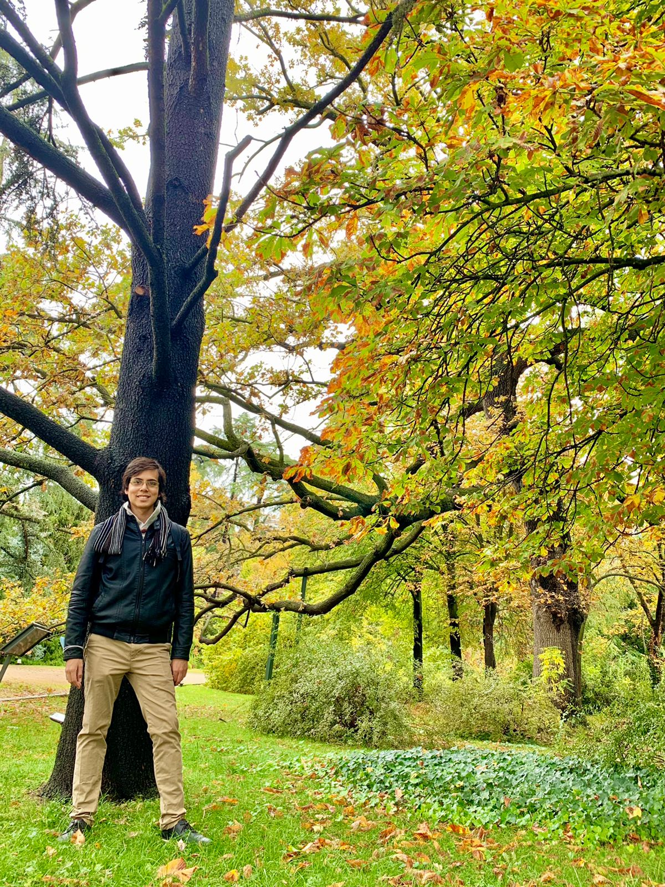{ width=90% }
</center>

### __I'm a `r emo::ji("peru")` researcher trained in genetics and skilled in health data science__

--------------------------------------


🏗️ 
I take **data** problems to learn new **tools** in the route to solve them, **motivated** by causal questions and **reproducible** research.
<!-- and satisfy my own expectations! -->
<!-- create -->
<!-- reproducible workflows and FAIR principles, reusable software -->
<!-- discussing their interpretation and implications. -->
<!-- satisfy my **own** expectations, and **motivate** myself :) -->

🔓 
Continuously integrating **open** science, **software** development and **teaching** online better practices!
<!-- from its *design* -->
<!-- **healthy** work habits -->

🌱 Interested in **systems** developmental biology,
**quantitative** and **bioengineering** approaches, living matter **configuration** principles.
<!-- 🌱 Interested in **quantitative** systems biology, **developmental** bioengineering, **signaling** and living matter **configuration** principles.  -->

⛑️ 
This website contains **links** to all my (reusable) scientific **contributions**. Here is a structured **pdf** version of my [cv/resume](https://github.com/avallecam/resume/raw/main/cv-andree_vallecampos.pdf).
<!-- in english [EN] and spanish [ES] -->


--------------------------------------

## vitae {.tabset .tabset-fade}

### bio

#### now

- 🎉 `R` Developer and Instructor at [The GRAPH Network](https://www.linkedin.com/company/the-graph-network/);
- 💻 Freelancer and remote teacher; 
<!-- - ✒️ Writing my thesis manuscripts! -->
- ✨ Crafted last [serosurvey](https://avallecam.github.io/serosurvey/) package 📦; 
- ⭐ Coordinator in a last [outbreak analysis](https://www.reconlearn.org/topics/spanish.html) [course](https://www.dge.gob.pe/portalnuevo/informativo/prensa/curso-internacional-en-analisis-de-brotes-modelamiento-y-respuesta-en-salud-publica/) in [latinamerica](https://twitter.com/avallecam/status/1413682203041701889?s=20);
<!-- https://www.cursoepidemias-col-peru-2021.org/ -->
<!-- https://mobile.twitter.com/cdc_peru/status/1392099144689401857 -->

#### bio

- 🏠 I am a *computationally-oriented* researcher trained in **genetics + biotechnology** and quantitative **epidemiological research**;
<!-- - 📜 I did my [MSc](https://github.com/avallecam/movmal) at the **Universidad Peruana Cayetano Heredia** (2018); -->
- 📜 I did my [MSc](https://github.com/avallecam/movmal) research about human mobility and malaria history in the peruvian amazon (**UPCH, 2018**);
<!-- - 📜 I did my [BSc](https://github.com/avallecam/abnomic) at the **Universidad Nacional Mayor de San Marcos** (2015); -->
- 📜 I did my [BSc](https://github.com/avallecam/abnomic) research about antibody responses and severe vivax malaria with protein microarrays (**UNMSM, 2015**);

#### skills

- ⚙️ I am a proficient **`R` user**, expert `tidy` data **wrangler** and `ggplot2` **visualization** enthusiast. 
- ☁️ I am fluid with `bash` for **automation**, `shh` for **remote** computing, and `shiny` for reactive **dashboards**.
- 📀 I have made **modeling workflows** with omic, serological, gps, health service, and outbreak **spatio-temporal** data;
- 🥤 I have complemented my **training** with awesome communities: [ictp-saifr](https://www.ictp-saifr.org/v-southern-summer-school-on-mathematical-biology/), [codata-rda](https://www.datascienceschools.org/), [recon](https://www.repidemicsconsortium.org/), [metadocencia](https://www.metadocencia.org/cursos/);

#### contact

- 💬 Ping [me](https://www.linkedin.com/in/avallecam/) about **applied biostatistics**, **data science education**, and **reproducible research**;
- 📫 Reach me: avallecam at gmail;
- 🐤 Tweet me: [`@avallecam`](https://twitter.com/avallecam).


--------------------------------------

### works

#### writings

- 🔖 __[opinion][ES] Data and transparency to fight against the coronavirus, 2020__
https://ojo-publico.com/1718/datos-y-transparencia-para-luchar-contra-el-coronavirus

- 🔖 __[editorial][ES] Health Data Science: Applications at CDC Perú, 2019__
https://avallecam.github.io/health_data_science_editorial/

#### publications

- 📚 I have my list of academic **publications** in  [orcid](https://orcid.org/0000-0002-7779-481X) and [scholar](https://scholar.google.com/citations?user=p1Tq4esAAAAJ);


```{r,message=FALSE,warning=FALSE}
library(tidyverse)
id <- "p1Tq4esAAAAJ"
scholar::get_publications(id) %>% 
  as_tibble() %>% 
  select(title:year) %>% 
  arrange(desc(year)) %>% 
  knitr::kable()
```

--------------------------------------

### resources

#### R packages 📦

status: learning in progress!

- 💙 [serosurvey](https://avallecam.github.io/serosurvey/) - estimate prevalences.
- 🚧 [incidenceflow](https://github.com/avallecam/incidenceflow) - epidemic workflows.
- 💚 [covid19viz](https://avallecam.github.io/covid19viz/) - access covid-19 data.
- 💚 [powder](https://github.com/avallecam/powder) - tidy power analysis.
- 🚧 [sitreper](https://github.com/avallecam/sitreper) - situational reports in peru.
- 💚 [cdcper](https://github.com/avallecam/cdcper) - funciones para el cdc perú.
- 💚 [epichannel](https://github.com/avallecam/epichannel) - create endemic channels.
- 💚 [epitidy](https://github.com/avallecam/epitidy) - table and model outputs.
- 🚧 [epihelper](https://avallecam.github.io/epihelper/) - custom (cool) funtions.
<!-- - 💡 [elixr](https://bit.ly/elixr_rpkg) - in-house elisa standardization. -->

#### dashboards

- 💾 disease surveillance: https://avallecam.github.io/shiny-server/per/index.html
- 💾 data exploration: https://avallecam.shinyapps.io/data_qc/ 
- [ES] translation: https://avallecam.shinyapps.io/data_qc-es/

#### templates

- ♻️ tables: https://bit.ly/epitables
- ♻️ manuscripts: https://bit.ly/draftmanuscript
- ♻️ survey-forms: https://ee.kobotoolbox.org/x/oW0aWyxX
- ♻️ linear regression: https://bit.ly/gglinearregression
- ♻️ website: https://github.com/avallecam/avallecam.github.io

#### lifeguards

- 📑 I have a code **cheatsheet** full of reproducible examples in [gist](https://gist.github.com/avallecam);
- 🌍 I have contributed **answers** for the [stackoverflow](https://stackoverflow.com/users/6702544/avallecam) community;
- 💌 I collect helpful **links** for a lot of topics in a public [trello board](https://trello.com/b/xtO9VP36/scibites).

<!-- https://rpubs.com/avallecam/ -->

--------------------------------------

### workshops

#### workshops

🖐️ __[ES] Introduction to statistical analysis of epidemics, 2021__

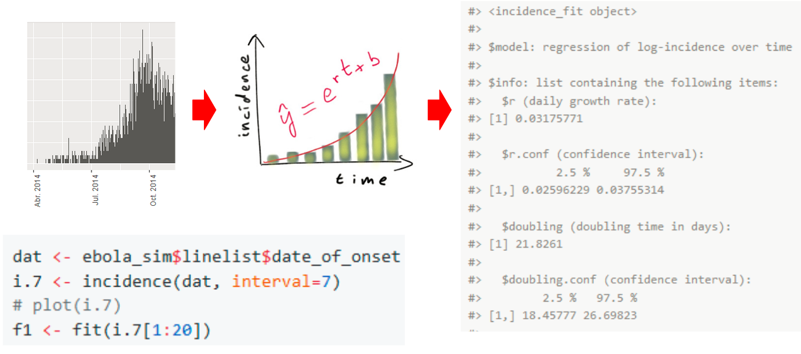{ width=100% }

- 🍭 slides: https://bit.ly/cursoepidemias-analisisbrote 
- ⚒️ tutorial: https://www.reconlearn.org/post/real-time-response-1-spanish.html

🖐️ __[ES] Introduction to R and Rstudio, 2021__

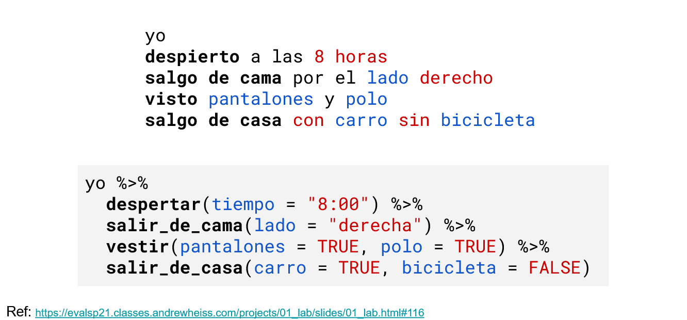{ width=100% }

- 🍭 slides: https://bit.ly/cursoepidemia-intror 
- ⚒️ tutorial: https://www.reconlearn.org/post/practical-intror-spanish.html

🖐️ __[ES] Introduction to ggplot2, 2021__

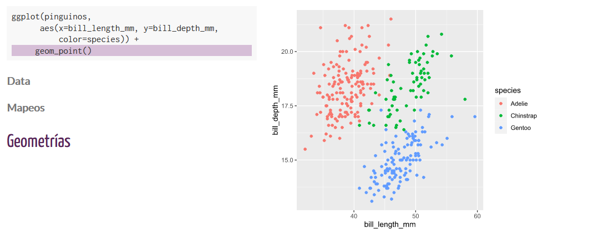{ width=100% }

- 🍭 slides: https://bit.ly/r08ggplot2 
- 🍿 video: https://youtu.be/waE31-OG8Ho
- 🍲 repo: https://github.com/avallecam/workshop_ggplot2 

🖐️ __[ES] Introduction to the use of R projects, 2021__

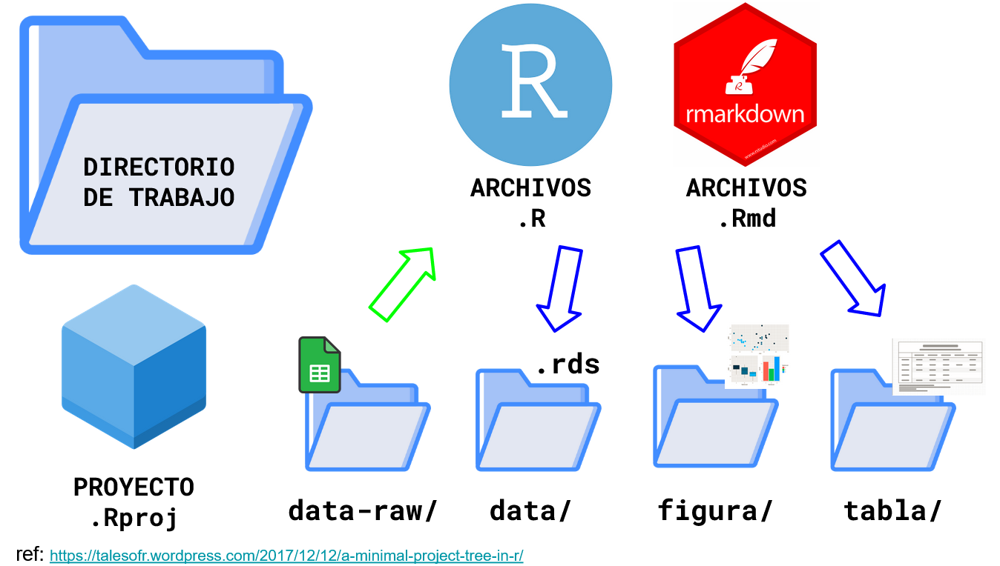{ width=100% }

- 🍭 slides: https://bit.ly/r02proyectos 
- 🍲 repo: https://cdcperucursos.github.io/cursorcdc1.html

🖐️ __[ES] Epidemiological analysis in R, 2019__

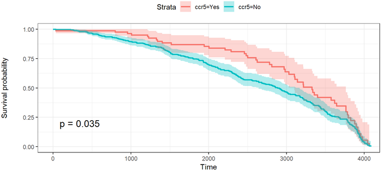{ width=100% }

- 🍭 slides: https://avallecam.github.io/epistat2019/r02.html#1 
- 🍲 repo: https://avallecam.github.io/epistat2019/ 

🖐️
__[ES] Linear models in R, 2019__

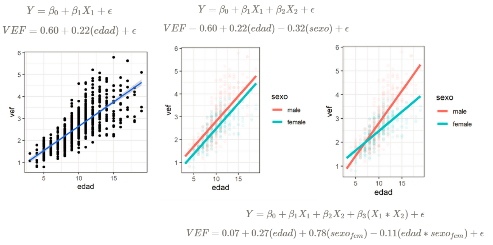{ width=100% }

- 🍭 slides: https://avallecam.github.io/epistat2019/r01.html#1
- 🍲 repo: https://avallecam.github.io/epistat2019/ 

🖐️ __[ES] Inferential statistics in R, 2019__

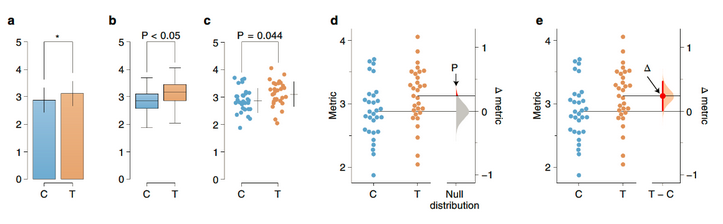{ width=100% }

- 🍭 slides: https://avallecam.github.io/biostat2019/00-biostat2019-slides.html#1 
- 🍲 repo: https://avallecam.github.io/biostat2019/ 

🖐️ __[ES] Microarray analysis with Tidyverse and Bioconductor, 2019__

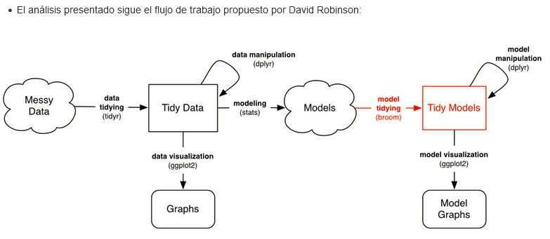{ width=100% }

- 🍲 repo: https://github.com/avallecam/bioinfo2019 

🖐️ __[ES] Reproducible Science and Microarray Analysis, 2017__

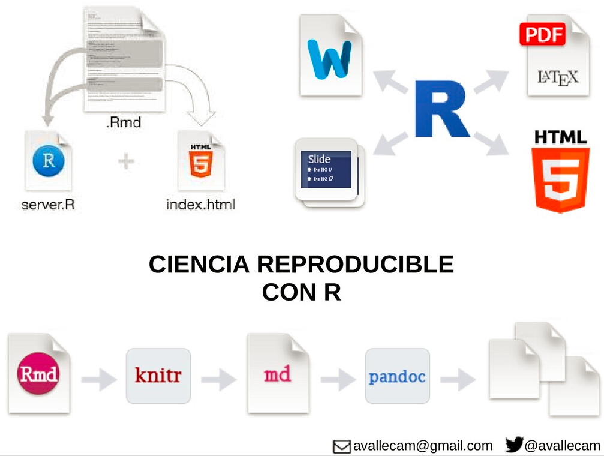{ width=100% }

- 🍭 slides: https://bit.ly/reproscience-intro 
- ⚒️ tutorial: https://avallecam.github.io/bioinfo2017/biocmicro.nb.html
- 🍲 repo: https://avallecam.github.io/bioinfo2017/ 

--------------------------------------

### lectures

#### lectures

📌 __[ES] Data analysis in epidemiological surveillance II: spatial analysis, 2021__

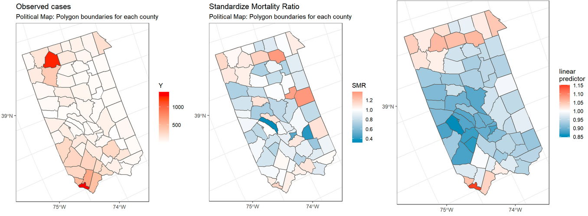{ width=100% }

- 🍭 slides: http://bit.ly/episurv2021parte2 
- ⚒️ tutorial: https://rpubs.com/avallecam/episurv2021parte2  

📌 __[ES] Data analysis in epidemiological surveillance I: person, place, time and epidemic curve, 2021__

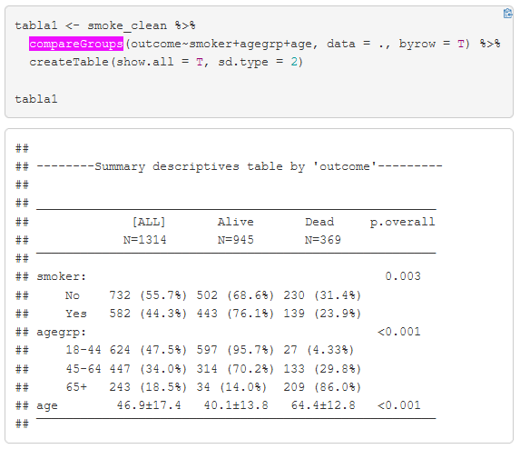{ width=100% }

- ⚒️ tutorial: https://rpubs.com/avallecam/episurv2021parte1 
- ⚒️ extra: endemic channel https://rpubs.com/avallecam/episurv2021 

📌 __[ES] Visualizing public health and field epidemiology data, 2021__

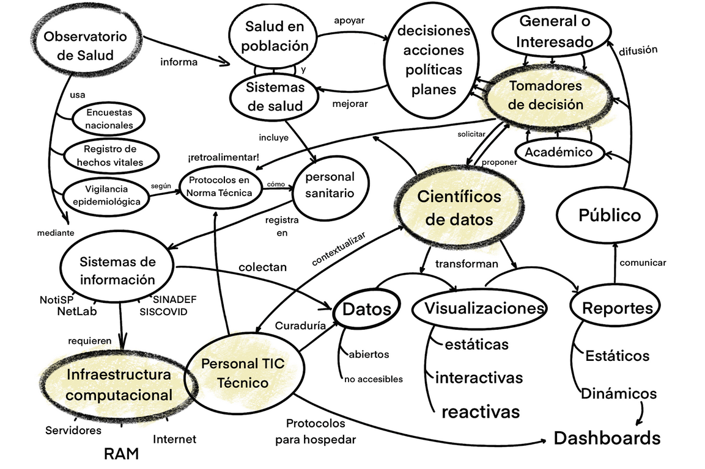{ width=100% }

- 🍭 slides: https://bit.ly/epiviz2021 

📌 __[ES] Algorithms for the detection of aberrations in epidemiological surveillance, 2020__

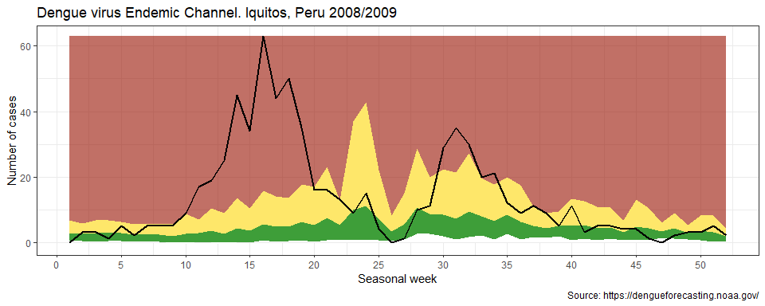{ width=100% }

- 🍭 slides: https://avallecam.github.io/episurv2020/0101-surveillance.html#1
- 🍲 repo: https://github.com/avallecam/episurv2020/blob/main/0101-surveillance.Rmd

📌 __[ES] Tardigrades and Bioinformatics in Horizontal Gene Transfer, 2016__

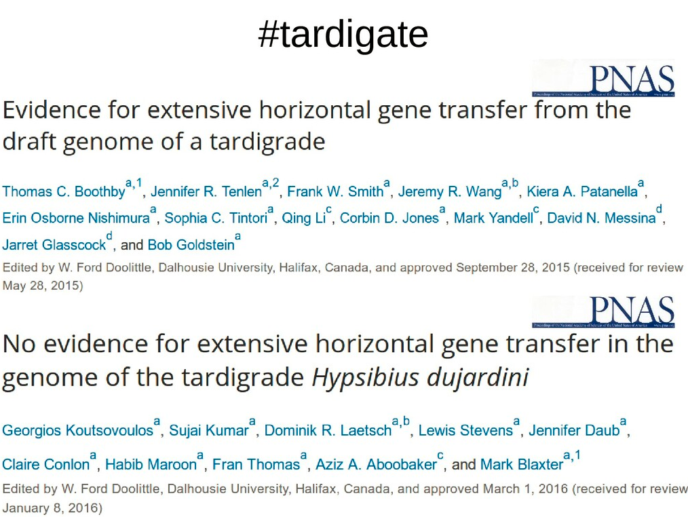{ width=100% }

- 🍭 slides: https://bit.ly/tardigate2016 

📌 __[ES] Gene regulatory networks using graph theory and finite automatas, 2015-2017__

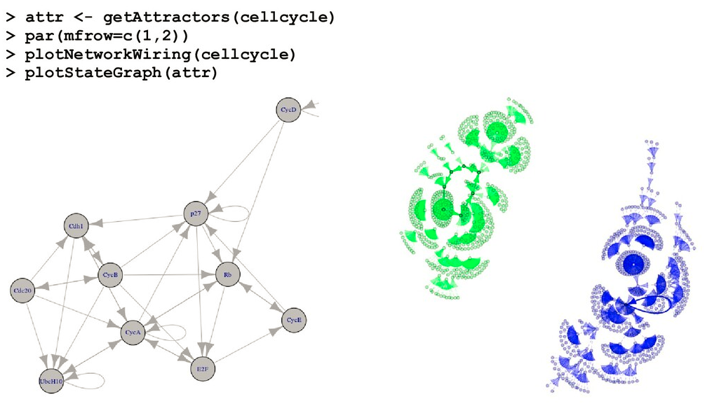{ width=100% }

- 🍭 slides: https://bit.ly/biomath2017_ 
- ⚒️ tutorial: https://github.com/avallecam/gene_regulatory_networks/blob/main/GRN_py/UNAM_mat2.ipynb
- 🍲 repo: https://github.com/avallecam/gene_regulatory_networks

--------------------------------------

### talks

#### talks

🔔 __serosurvey: Serological Surveys and Prevalence Estimation Under Misclassification, 2021__

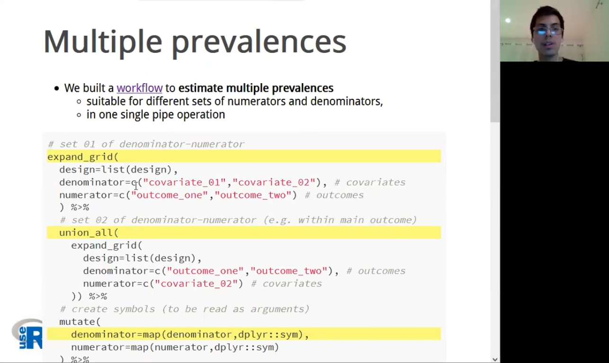{ width=100% }

- 🍭 slides: https://bit.ly/serosurvey-user21 
- 🍿 video: https://youtu.be/0mugb1mE68g
- 🍲 repo: https://github.com/avallecam/serosurvey-user21 

🔔 __[ES] Introduction to spatial analysis, 2021__

- 🍭 slides: https://bit.ly/espacial2021 

🔔 __[ES] Analysis of #multiple epidemics and prevalences with R and purrr, 2020__

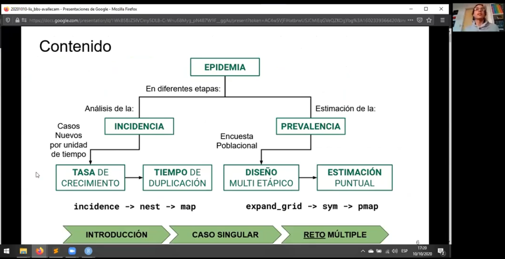{ width=100% }

- 🍭 slides: https://bit.ly/bbslisepi 
- 🍿 video: https://youtu.be/mxX8tDmC45E
<!-- https://imtavh.cayetano.edu.pe/videos/innovacion-en-salud -->

🔔 __[ES] Causal questions for hypothetical interventions, 2020__

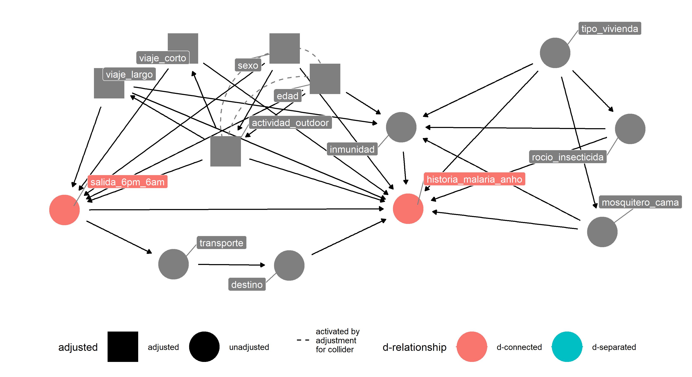{ width=100% }

- 🍭 slides: https://bit.ly/casual_question 

🔔 __[ES] Hypothesis testing with nonparametric statistical methods, 2020__

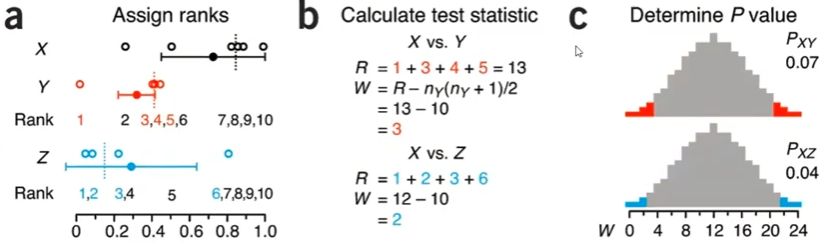{ width=100% }

- 🍭 slides: https://bit.ly/noparam2020 
- 🍿 video: https://youtu.be/1MTt1Ro-OP4

🔔 __[ES] Epidemiological analysis of the epidemic of Guillain Barré Syndrome in Peru, 2019__

- 💾 (better)poster: https://raw.githubusercontent.com/avallecam/cdcperu-gt_investigacion/master/20191120-poster-SGB-INSv3.jpg 
- 🍲 repo: https://avallecam.github.io/cdcperu-gt_investigacion/

<!-- 🔔 __[abstract][ES] Changes in the morbidity and mortality profiles in Peru (2002-2016). Aplications with R and cdcper R package, 2019__ -->

<!-- - 💾 poster:   -->
<!-- - 🍲 repo: https://rpmesp.ins.gob.pe/rpmesp/article/view/5178 -->

🔔 __Human mobility and malaria history in a periurban community of the Peruvian Amazon, 2019__

- 💾 poster: https://raw.githubusercontent.com/avallecam/movmal/master/poster/astmh_poster-ValleAA-20191116.jpg 
- 🍲 repo: https://github.com/avallecam/movmal

🔔 __[ES] R applied to epidemiology, 2019__

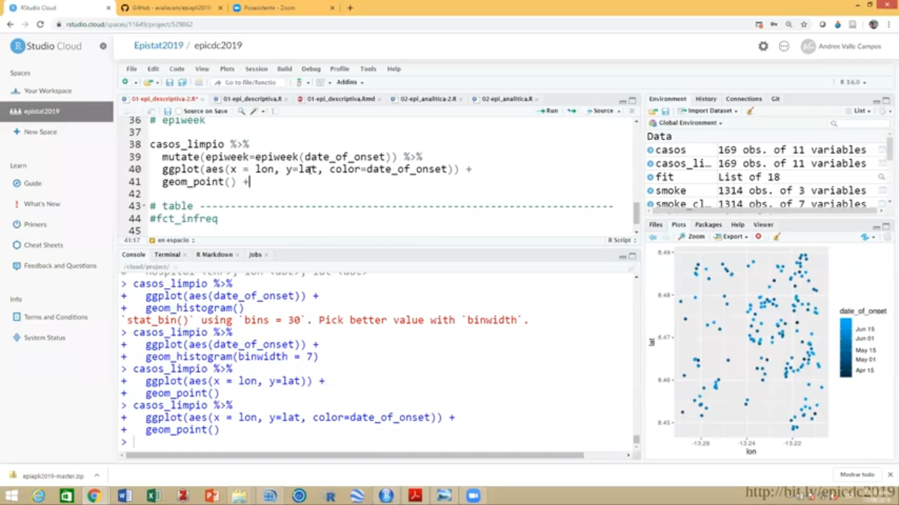{ width=100% }

- 🍭 slides: https://speakerdeck.com/avallecam/r-aplicado-a-epidemiologia 
- 🍿 video: https://youtu.be/C3Yqw883jrs
- 🍲 repo: https://avallecam.github.io/epiapli2019/ 

🔔 __[ES] cdcper: data report and visualization in CDC Peru using R, 2019__

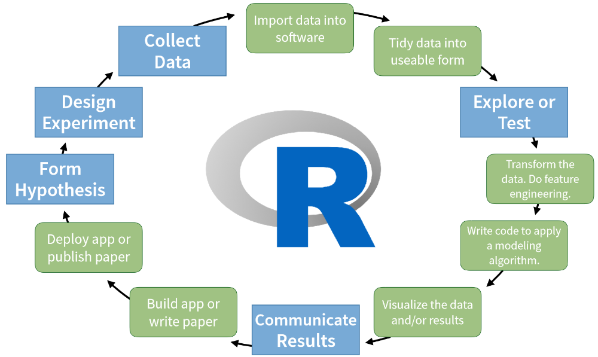{ width=100% }

- 🍭 slides: https://speakerdeck.com/avallecam/cdcper-reporte-y-visualizacion-de-datos-en-cdc-peru-usando-r

--------------------------------------

## about

### about me

- 🏊 I was a [swimmer (lane #5)](https://www.youtube.com/watch?v=fN7sJPFeJcw);
- 🎬 I love watching [musical videos](https://youtube.com/playlist?list=PLDHw5KzS-qvL90chbF74RS3fAU5JdtVzZ);
- `r emo::ji("peru")` I have a playlist of [peruvian music](https://youtube.com/playlist?list=PLDHw5KzS-qvKv1z5CBELuQnqanqfZ4WSy);
- 🗃️ 
I store [artmospheres](https://www.instagram.com/avallecam_/) in a couple [more]((https://www.youtube.com/channel/UCvbhEkxtIVA9ldfhqDFALTA/playlists));
- 🎼 I occasionally [play](https://soundcloud.com/avallecam) guitar🎸|piano🎹;
- 🖤 I read a manga called [berserk](https://readberserk.com/chapter/berserk-chapter-a0/);
- 🌠 I feed a wishlist in [elfster](https://www.elfster.com/profile/097d261f-1196-45a1-a4b4-12e0b245ce2d/wish-lists/be4efeaf-b9e7-465d-bcac-65ef129be519/);
- 🎨 I appreciate visiting [art galleries](https://coleccion.mali.pe/collections), [unexpected](https://maclima.pe/project/visitante-fernando-de-szyszlo/) findings [occur](https://www.metmuseum.org/es/art/collection/search/267838);
- 🥦 I got curious on physical biology after: [goodwin](https://libgen.rs/book/index.php?md5=CBFF641AD61645A284EE4566EB2B0146), [bejan](https://libgen.rs/book/index.php?md5=F9D8AF5DCDF3C74ED2C34A56C7522E22), [leibler](https://journals.aps.org/prx/abstract/10.1103/PhysRevX.5.041014);
<!-- [cabrera](https://www.researchgate.net/publication/313988377_ON_NATURAL_STRUCTURES_THE_UNIFICATION_OF_NATURE) -->
<!-- [newman](http://www.ijdb.ehu.es/web/paper/072481sn/dynamical-patterning-modules-a-pattern-language-for-development-and-evolution-of-multicellular-form) -->
<!-- philosophy old books like -->
- 🌩️ I enjoy reading dialectical materialism: [politzer](https://libgen.rs/book/index.php?md5=BDA5E8E26C125758A4C809D3C74F2136), [fromm](https://libgen.rs/book/index.php?md5=2B4A32A41996AEFB7D810F90A67EAEE2), [engels](https://libgen.rs/book/index.php?md5=64BA70A56CE5241A442C2056B3766995);
- 🎲 I like listening to [radiohead](https://youtu.be/I4pezRt9boY), [apparat](https://youtu.be/NOol5V4Tlk8), [niños sin](https://youtu.be/S5vKPHigWqY) [smartphones](https://youtu.be/QI9mksVqivg);
- 🍥 I am [learning](https://www.a11yproject.com/) to design [accessible](https://user2021.r-project.org/participation/accessibility/) outputs.
<!-- > #a11y - nothing about us without us -->
<!-- - I am interested in discussing about how to provide local solutions against local [inequalities](https://unsdg.un.org/2030-agenda/universal-values/leave-no-one-behind) in society -->

#### avallecam

- 🌞 Stands for **a**ndree **valle** **cam**pos.
- 💕 I intentionally used [**cam**](https://www.mychinaroots.com/surnames/detail?word=Campos) because I am [#tusan](http://www.tusanaje.org/ser-tusan/)
<!-- - 📦 It is also the name of my first R package, now hosted [elsewhere](https://avallecam.github.io/epihelper/)  -->

--------------------------------------

# {-}

<center>
{ width=10% }
</center>
<center>
{ width=3% }
Andree Valle-Campos, 2021
</center>

<!-- `r knitr::asis_output("\U1F12F")` -->
<!-- ⊜  -->