<!-- Render with: rmarkdown::render("index.Rmd") -->

<style type="text/css">

.main-container {
  max-width: 540px;
}

body {
    font-family: "Noto Sans","Helvetica Neue",Helvetica,Arial,sans-serif;
    font-size: 15px;
    line-height: 1.7;
    color: #222;
    font-weight: 400;
}


p {
  margin-bottom: 16px;
  }
  
ul, ol, table, pre, dl {
    margin: 0 0 20px;
}

</style>

```{r, include = FALSE}
knitr::opts_chunk$set(
  collapse = TRUE,
  comment = "#>",
  fig.path = "man/figures/README-",
  out.width = "100%"
)
```

```{r,eval=FALSE,echo=FALSE,message=FALSE,warning=FALSE}
if(!require("pak")) install.packages("pak")
if(!require("tidyverse")) pak::pak("tidyverse")
if(!require("scholar")) pak::pak("scholar")
if(!require("knitr")) pak::pak("knitr")
```

```{r,echo=FALSE,message=FALSE,warning=FALSE}
library(emo)
library(tidyverse)
library(scholar)
library(knitr)
```


# I'm **Andree Valle Campos** y uso muchos emojis •ᴗ• {.tabset .tabset-fade}

<!-- and my pronouns are **él/he/his** -->

## english {.tabset .tabset-pills .tabset-fade}

### home

<center>
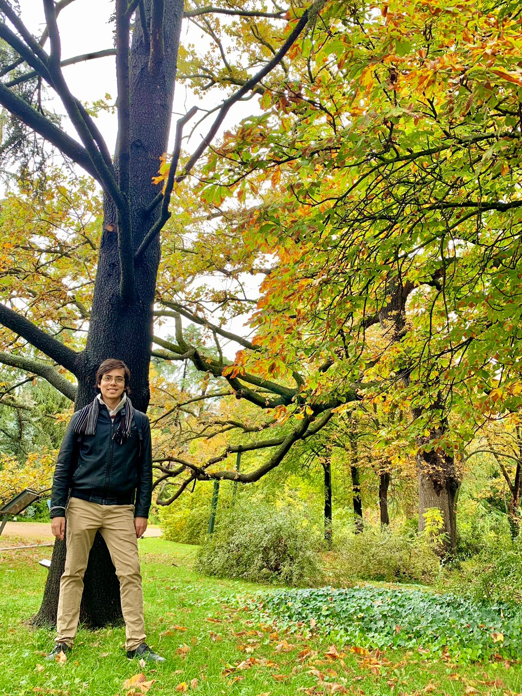{ width=90% }
</center>

#### __I'm a `r emo::ji("peru")` who works in epidemiology, serology, and outbreak research using 💻 health data science!__

<!-- genomics -->

--------------------------------------


🏗️ 
I take **data** problems to learn new **tools** in the route to solve them, **motivated** by causal questions and **reproducible** research.
<!-- and satisfy my own expectations! -->
<!-- create -->
<!-- reproducible workflows and FAIR principles, reusable software -->
<!-- discussing their interpretation and implications. -->
<!-- satisfy my **own** expectations, and **motivate** myself :) -->

🔓 
Continuously integrating **open** science, **software** development and **teaching** online good practices!
<!-- from its *design* -->
<!-- **healthy** work habits -->

🌱 Interested in **systems** developmental biology,
**quantitative** and **bioengineering** approaches, & living matter **configuration** principles.
<!-- 🌱 Interested in **quantitative** systems biology, **developmental** bioengineering, **signaling** and living matter **configuration** principles.  -->

⛑️ 
This website contains **links** to all my (reusable) scientific **contributions**. Here is a structured **pdf** version of my [cv/resume](https://github.com/avallecam/resume/raw/main/cv-andree_vallecampos.pdf).
<!-- in english [EN] and spanish [ES] -->


--------------------------------------

### vitae {.tabset .tabset-fade}

#### bio

##### now

<!-- - 💻 Freelancer and remote teacher;  -->
<!-- - ✒️ Writing my thesis manuscripts! -->
- 🎉 Community building and Training at [the Epiverse-TRACE](https://data.org/initiatives/epiverse/);
- 🍎 Crafted a [GeoViz](https://thegraphcourses.org/courses/geospatial-visualization/) with `R` lesson for [The GRAPH Network](https://thegraphcourses.org/courses-portal/);
- 📦 Crafted last [serosurvey](https://avallecam.github.io/serosurvey/) package ✨;
- ⭐ Coordinator in a last [outbreak analysis](https://www.reconlearn.org/topics/spanish.html) [course](https://www.dge.gob.pe/portalnuevo/informativo/prensa/curso-internacional-en-analisis-de-brotes-modelamiento-y-respuesta-en-salud-publica/) in [latinamerica](https://twitter.com/avallecam/status/1413682203041701889?s=20);
<!-- https://www.cursoepidemias-col-peru-2021.org/ -->
<!-- https://mobile.twitter.com/cdc_peru/status/1392099144689401857 -->

##### bio

- 🏠 I have trained in *scientific computing* practices for **genetics and biotech**, and applied statistics in **epidemiology**;
<!-- - 📜 I did my [MSc](https://github.com/avallecam/movmal) at the **Universidad Peruana Cayetano Heredia** (2018); -->
- 📜 I did my [MSc](https://github.com/avallecam/movmal) research about human mobility and malaria history in the peruvian amazon (**UPCH, 2018**);
<!-- - 📜 I did my [BSc](https://github.com/avallecam/abnomic) at the **Universidad Nacional Mayor de San Marcos** (2015); -->
- 📜 I did my [BSc](https://github.com/avallecam/abnomic) research about antibody responses and severe vivax malaria with protein microarrays (**UNMSM, 2015**);

##### skills

- ⚙️ I am a proficient **`R` user**, expert `tidy` data **wrangler** and `ggplot2` **visualization** enthusiast. 
- ☁️ I am fluid with `bash` for **automation**, `shh` for **remote** computing, and `shiny` for reactive **dashboards**.
- 📀 I have *tried to* make **statistical workflows** with omic, serological, gps, health service, and outbreak **spatio-temporal** data;
- 🥤 I have complemented my **training** with awesome communities: [ictp-saifr](https://www.ictp-saifr.org/v-southern-summer-school-on-mathematical-biology/), [codata-rda](https://www.datascienceschools.org/), [recon](https://www.repidemicsconsortium.org/), [metadocencia](https://www.metadocencia.org/cursos/), [carpentries](https://carpentries.github.io/instructor-training/);

##### contact

- 💬 Ping [me](https://www.linkedin.com/in/avallecam/) about **`R` in epidemiology**, **data science education**, and **applied biostatistics**;
- 📫 Reach me: avallecam at gmail;
- 🐤 Tweet me: [`@avallecam`](https://twitter.com/avallecam).


--------------------------------------

#### works

##### writings

- 🔖 __[editorial][ES] Health Data Science: Applications at CDC Perú, 2019__
https://avallecam.github.io/health_data_science_editorial/

- 🔖 __[opinion][ES] Data and transparency to fight against the coronavirus, 2020__
https://ojo-publico.com/1718/datos-y-transparencia-para-luchar-contra-el-coronavirus

##### publications

- 📚 I have my list of academic **publications** in  [orcid](https://orcid.org/0000-0002-7779-481X) and [scholar](https://scholar.google.com/citations?user=p1Tq4esAAAAJ);


```{r,message=FALSE,warning=FALSE}
library(tidyverse)
library(scholar)
library(knitr)

id <- "p1Tq4esAAAAJ"

scholar::get_publications(id) %>% 
  as_tibble() %>% 
  select(title:year) %>% 
  arrange(desc(cites)) %>% 
  knitr::kable()
```

##### blog

- [20220919-test](blog/20220919-blog-test.html)

--------------------------------------

#### resources

##### R packages 📦

status: learning in progress!

- 💙 [serosurvey](https://avallecam.github.io/serosurvey/) - estimate prevalences.
- 🚧 [incidenceflow](https://github.com/avallecam/incidenceflow) - epidemic workflows.
- 💚 [covid19viz](https://avallecam.github.io/covid19viz/) - access covid-19 data.
- 💚 [powder](https://github.com/avallecam/powder) - tidy power analysis.
- 🚧 [sitreper](https://github.com/avallecam/sitreper) - situational reports in peru.
- 💚 [cdcper](https://github.com/avallecam/cdcper) - funciones para el cdc perú.
- 💚 [epichannel](https://github.com/avallecam/epichannel) - create endemic channels.
- 💚 [epitidy](https://github.com/avallecam/epitidy) - table and model outputs.
- 🚧 [epihelper](https://avallecam.github.io/epihelper/) - custom (cool) funtions.
<!-- - 💡 [elixr](https://bit.ly/elixr_rpkg) - in-house elisa standardization. -->

##### dashboards

- 💾 disease surveillance: https://avallecam.github.io/shiny-server/per/index.html
- 💾 data exploration: https://avallecam.shinyapps.io/data_qc/ 
- [ES] translation: https://avallecam.shinyapps.io/data_qc-es/

##### templates

- ♻️ tables: https://bit.ly/epitables
- ♻️ manuscripts: https://bit.ly/draftmanuscript
- ♻️ survey-forms: https://ee.kobotoolbox.org/x/oW0aWyxX
- ♻️ linear regression: https://bit.ly/gglinearregression
- ♻️ website: https://github.com/avallecam/avallecam.github.io

##### lifeguards

- 📑 I have a code **cheatsheet** full of reproducible examples in [gist](https://gist.github.com/avallecam);
- 🌍 I have contributed **answers** for the [stackoverflow](https://stackoverflow.com/users/6702544/avallecam) community;
- 💌 I collect helpful **links** for a lot of topics in a public [trello board](https://trello.com/b/xtO9VP36/scibites).

<!-- https://rpubs.com/avallecam/ -->

--------------------------------------

#### workshops

##### workshops

🖐️ __[ES] Introduction to statistical analysis of epidemics, 2021__

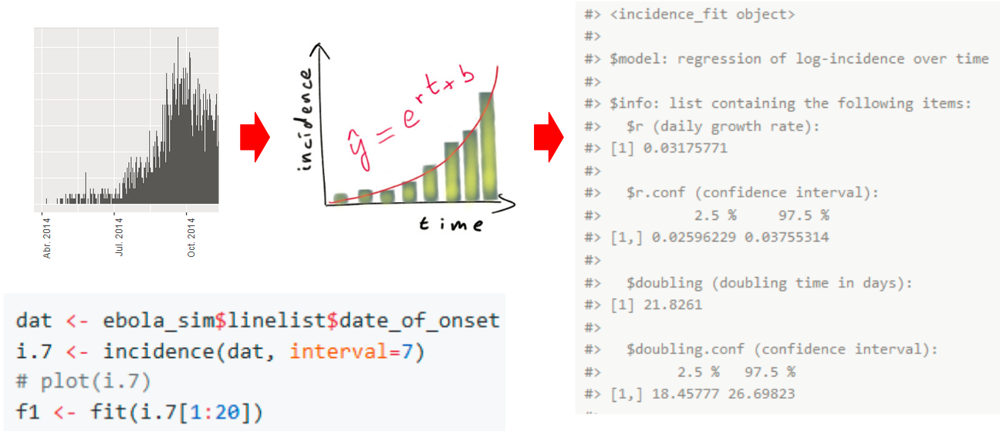{ width=100% }

- 🍭 slides: https://bit.ly/cursoepidemias-analisisbrote 
- ⚒️ tutorial: https://www.reconlearn.org/post/real-time-response-1-spanish.html

🖐️ __[ES] Introduction to R and Rstudio, 2021__

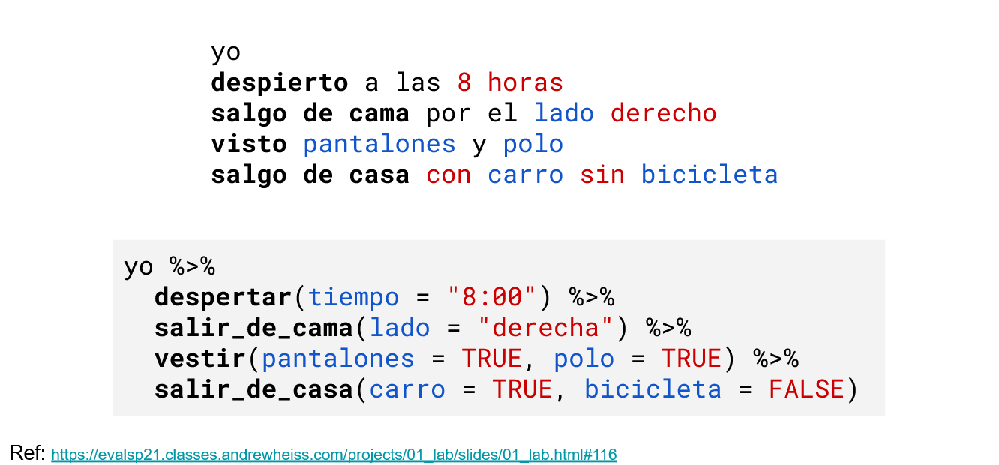{ width=100% }

- 🍭 slides: https://bit.ly/cursoepidemia-intror 
- ⚒️ tutorial: https://www.reconlearn.org/post/practical-intror-spanish.html

🖐️ __[ES] Introduction to ggplot2, 2021__

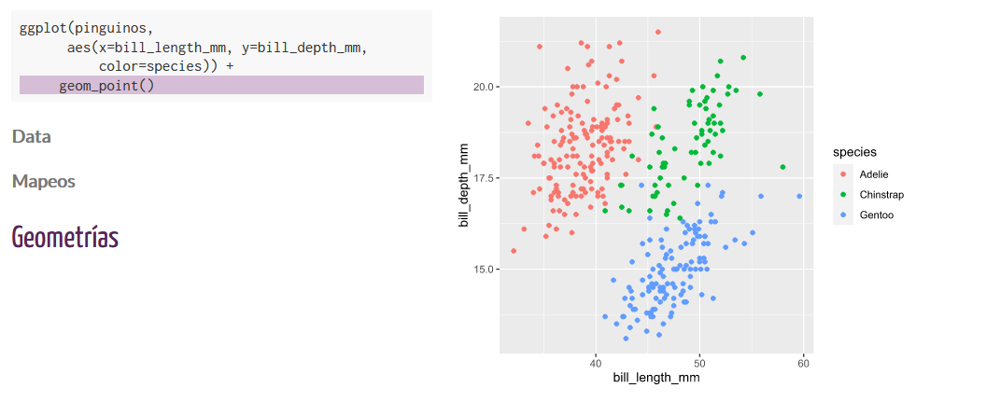{ width=100% }

- 🍭 slides: https://bit.ly/r08ggplot2 
- 🍿 video: https://youtu.be/waE31-OG8Ho
- 🍲 repo: https://github.com/avallecam/workshop_ggplot2 

🖐️ __[ES] Introduction to the use of R projects, 2021__

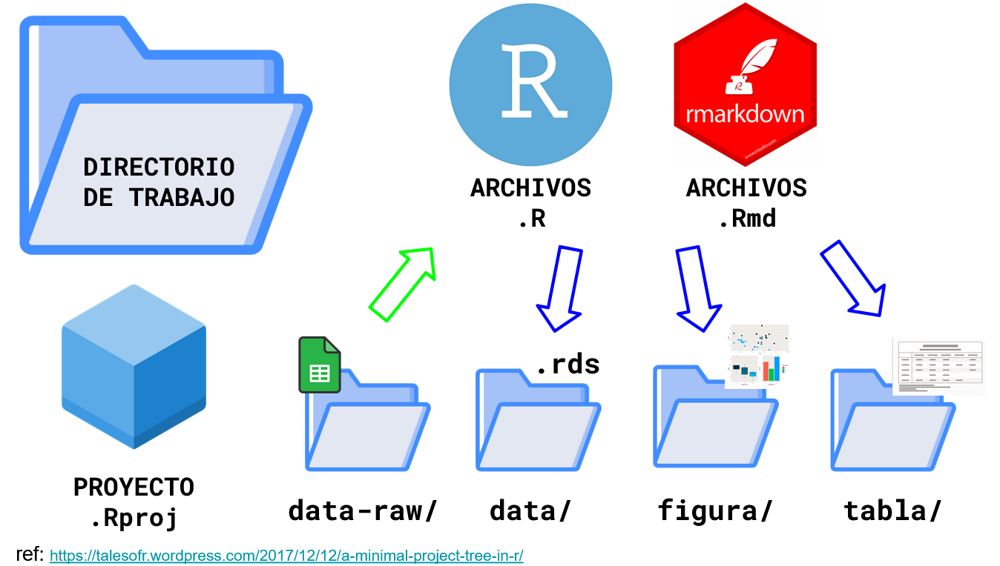{ width=100% }

- 🍭 slides: https://bit.ly/r02proyectos 
- 🍲 repo: https://cdcperucursos.github.io/cursorcdc1.html

🖐️ __[ES] Epidemiological analysis in R, 2019__

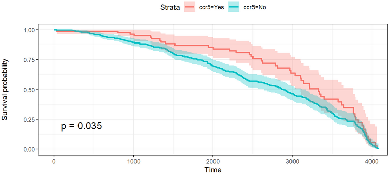{ width=100% }

- 🍭 slides: https://avallecam.github.io/epistat2019/r02.html 
- 🍲 repo: https://avallecam.github.io/epistat2019/ 

🖐️
__[ES] Linear models in R, 2019__

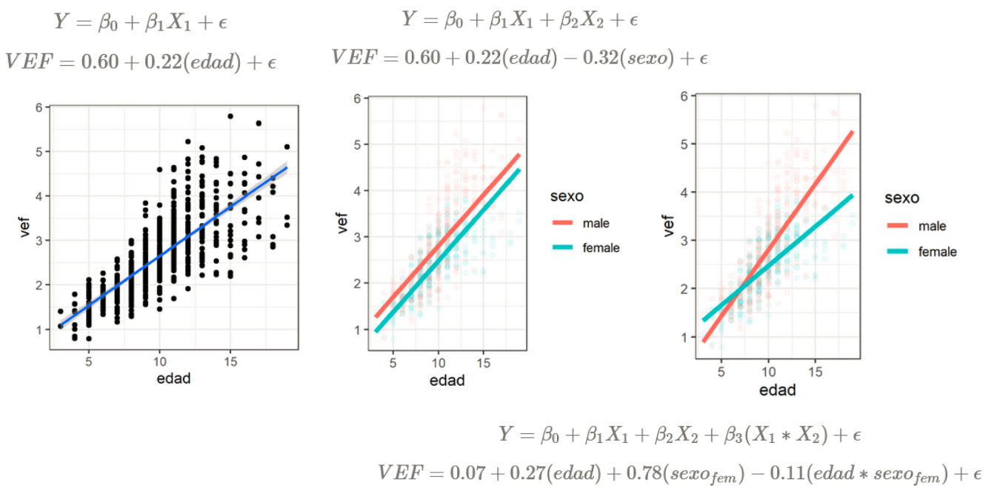{ width=100% }

- 🍭 slides: https://avallecam.github.io/epistat2019/r01.html
- 🍲 repo: https://avallecam.github.io/epistat2019/ 

🖐️ __[ES] Inferential statistics in R, 2019__

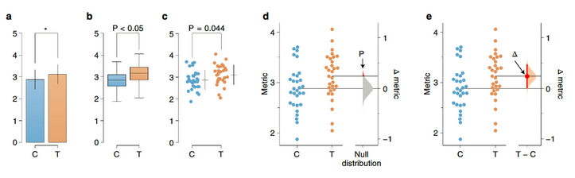{ width=100% }

- 🍭 slides: https://avallecam.github.io/biostat2019/00-biostat2019-slides.html 
- 🍲 repo: https://avallecam.github.io/biostat2019/ 

🖐️ __[ES] Microarray analysis with Tidyverse and Bioconductor, 2019__

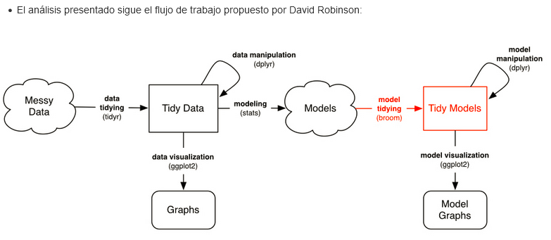{ width=100% }

- 🍲 repo: https://github.com/avallecam/bioinfo2019 

🖐️ __[ES] Reproducible Science and Microarray Analysis, 2017__

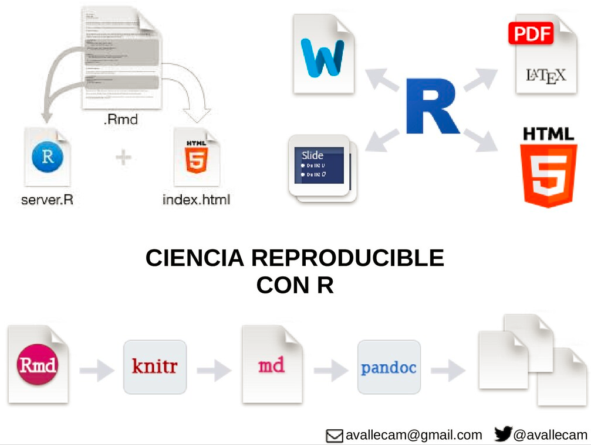{ width=100% }

- 🍭 slides: https://bit.ly/reproscience-intro 
- ⚒️ tutorial: https://avallecam.github.io/bioinfo2017/biocmicro.nb.html
- 🍲 repo: https://avallecam.github.io/bioinfo2017/ 

--------------------------------------

#### lectures

##### lectures

📌 __[ES] Data analysis in epidemiological surveillance II: spatial analysis, 2021__

{ width=100% }

- 🍭 slides: http://bit.ly/episurv2021parte2 
- ⚒️ tutorial: https://rpubs.com/avallecam/episurv2021parte2  

📌 __[ES] Data analysis in epidemiological surveillance I: person, place, time and epidemic curve, 2021__

{ width=100% }

- ⚒️ tutorial: https://rpubs.com/avallecam/episurv2021parte1 
- ⚒️ extra: endemic channel https://rpubs.com/avallecam/episurv2021 

📌 __[ES] Visualizing public health and field epidemiology data, 2021__

{ width=100% }

- 🍭 slides: https://bit.ly/epiviz2021 

📌 __[ES] Algorithms for the detection of aberrations in epidemiological surveillance, 2020__

{ width=100% }

- 🍭 slides: https://avallecam.github.io/episurv2020/0101-surveillance.html
- 🍲 repo: https://github.com/avallecam/episurv2020/blob/main/0101-surveillance.Rmd

📌 __[ES] Tardigrades and Bioinformatics in Horizontal Gene Transfer, 2016__

{ width=100% }

- 🍭 slides: https://bit.ly/tardigate2016 

📌 __[ES] Gene regulatory networks using graph theory and finite automatas, 2015-2017__

{ width=100% }

- 🍭 slides: https://bit.ly/biomath2017_ 
- ⚒️ tutorial: https://github.com/avallecam/gene_regulatory_networks/blob/main/GRN_py/UNAM_mat2.ipynb
- 🍲 repo: https://github.com/avallecam/gene_regulatory_networks

--------------------------------------

#### talks

##### talks

🔔 __serosurvey: Serological Surveys and Prevalence Estimation Under Misclassification, 2021__

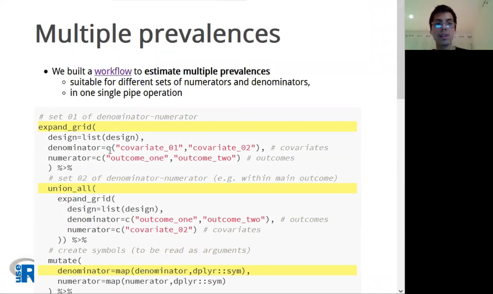{ width=100% }

- 🍭 slides: https://bit.ly/serosurvey-user21 
- 🍿 video: https://youtu.be/0mugb1mE68g
- 🍲 repo: https://github.com/avallecam/serosurvey-user21 

🔔 __[ES] Introduction to spatial analysis, 2021__

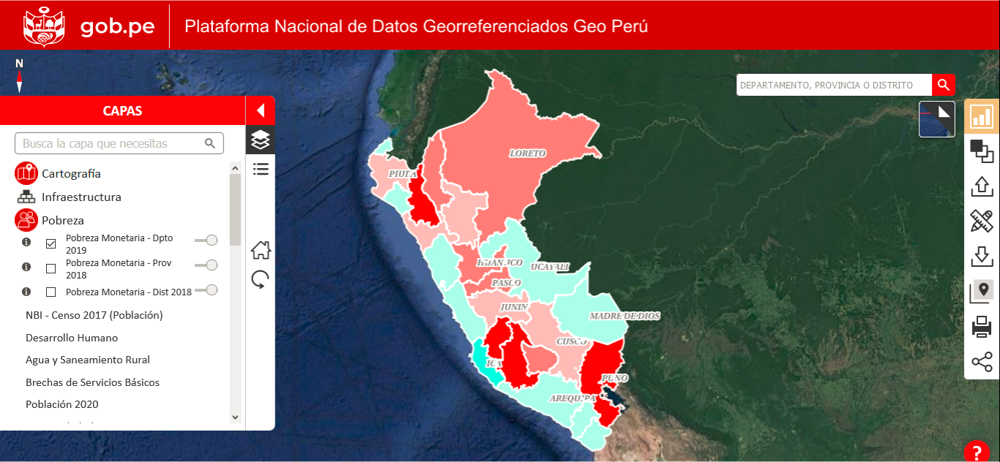{ width=100% }

- 🍭 slides: https://bit.ly/espacial2021 

🔔 __[ES] Analysis of #multiple epidemics and prevalences with R and purrr, 2020__

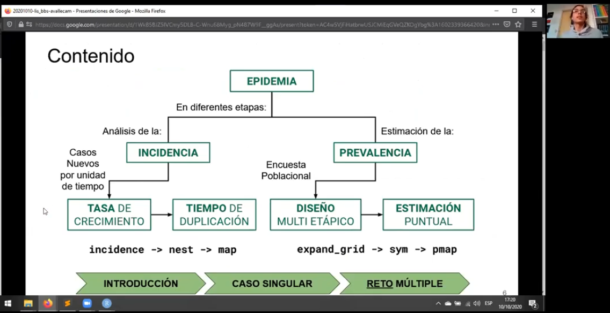{ width=100% }

- 🍭 slides: https://bit.ly/bbslisepi 
- 🍿 video: https://youtu.be/mxX8tDmC45E
<!-- https://imtavh.cayetano.edu.pe/videos/innovacion-en-salud -->

🔔 __[ES] Causal questions for hypothetical interventions, 2020__

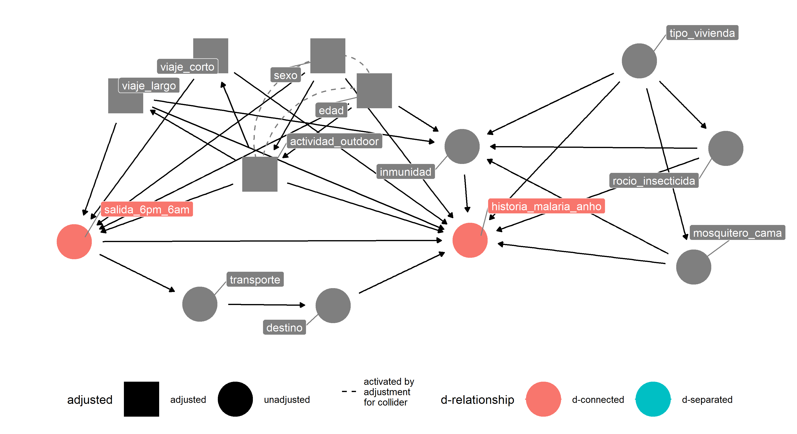{ width=100% }

- 🍭 slides: https://bit.ly/casual_question 

🔔 __[ES] Hypothesis testing with nonparametric statistical methods, 2020__

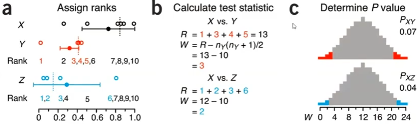{ width=100% }

- 🍭 slides: https://bit.ly/noparam2020 
- 🍿 video: https://youtu.be/1MTt1Ro-OP4

🔔 __[ES] Epidemiological analysis of the epidemic of Guillain Barré Syndrome in Peru, 2019__

<center>
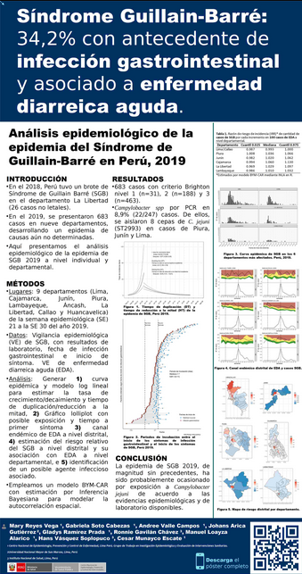{ width=30% }
</center>

- 💾 (better)poster: https://raw.githubusercontent.com/avallecam/cdcperu-gt_investigacion/master/20191120-poster-SGB-INSv3.jpg 
- 🍲 repo: https://avallecam.github.io/cdcperu-gt_investigacion/

🔔 __[abstract][ES] Changes in the morbidity and mortality profiles in Peru (2002-2016). Aplications with R and cdcper R package, 2019__

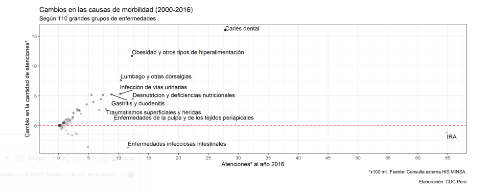{ width=100% }

<!-- - 💾 poster: -->
- 🍲 abstract: https://rpmesp.ins.gob.pe/rpmesp/article/view/5178

🔔 __Human mobility and malaria history in a periurban community of the Peruvian Amazon, 2019__

<center>
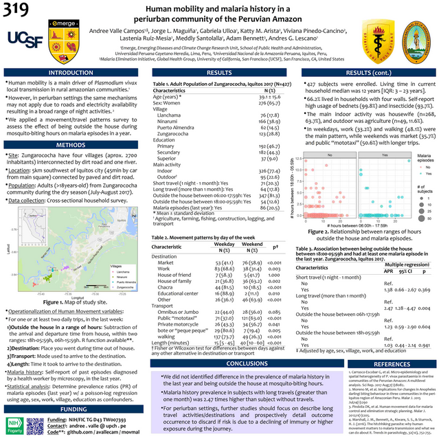{ width=50% }
</center>

- 💾 poster: https://raw.githubusercontent.com/avallecam/movmal/master/poster/astmh_poster-ValleAA-20191116.jpg 
- 🍲 repo: https://github.com/avallecam/movmal

🔔 __[ES] R applied to epidemiology, 2019__

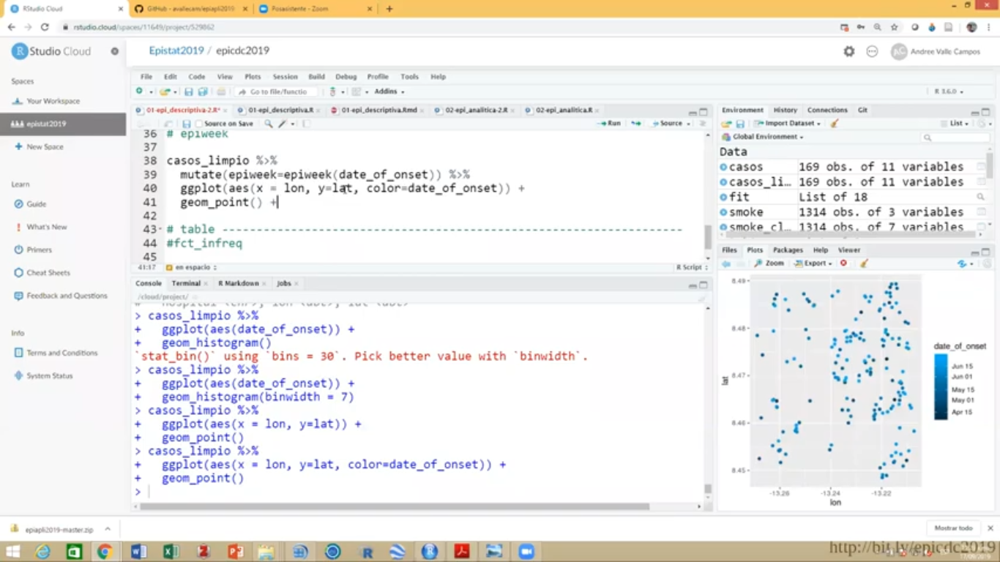{ width=100% }

- 🍭 slides: https://speakerdeck.com/avallecam/r-aplicado-a-epidemiologia 
- 🍿 video: https://youtu.be/C3Yqw883jrs
- 🍲 repo: https://avallecam.github.io/epiapli2019/ 

🔔 __[ES] cdcper: data report and visualization in CDC Peru using R, 2019__

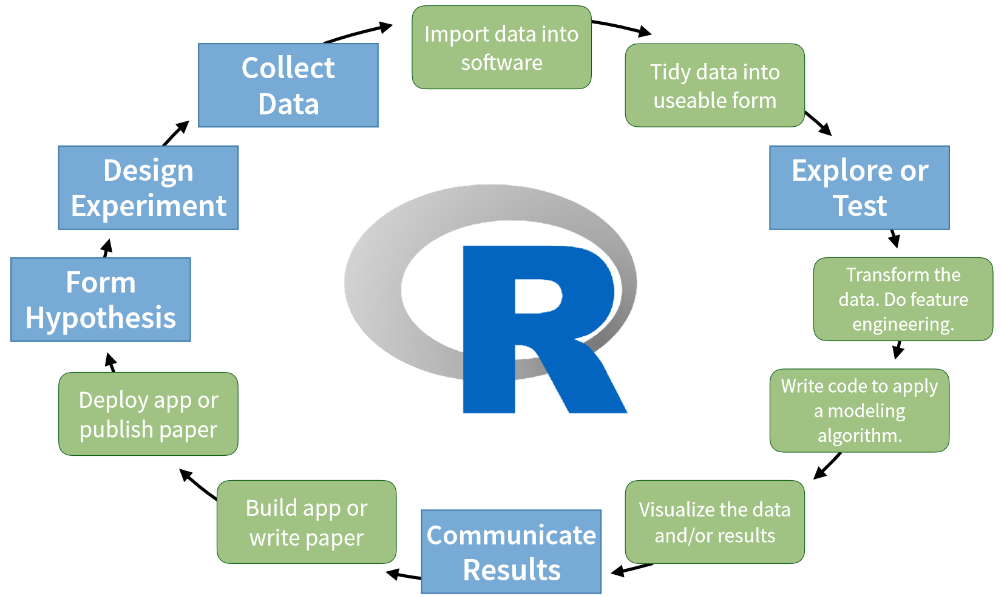{ width=100% }

- 🍭 slides: https://speakerdeck.com/avallecam/cdcper-reporte-y-visualizacion-de-datos-en-cdc-peru-usando-r

--------------------------------------

### about

#### about me

- 🏊 I was a [swimmer (lane #5)](https://www.youtube.com/watch?v=fN7sJPFeJcw);
- 🎬 I love watching [musical videos]( https://bit.ly/avc-musicamundial);
- `r emo::ji("peru")` I have a playlist of [peruvian music](https://bit.ly/avc-musicaperuana);
- 🗃️ 
I store [artmospheres](https://www.instagram.com/recursivoo/) in a couple [more]((https://www.youtube.com/channel/UCvbhEkxtIVA9ldfhqDFALTA/playlists));
- 🎼 I occasionally [play](https://soundcloud.com/avallecam) guitar🎸|piano🎹;
- 🖤 I read a manga called [berserk](https://readberserk.com/chapter/berserk-chapter-a0/);
- 🍃 I watch an anime called [naruto](https://www.crunchyroll.com/series/GY9PJ5KWR/naruto), previously [avatar](https://www.netflix.com/gb/title/70142405);
- 🎨 I appreciate visiting [art galleries](https://coleccion.mali.pe/collections), [unexpected](https://maclima.pe/project/visitante-fernando-de-szyszlo/) findings [occur](https://www.metmuseum.org/es/art/collection/search/267838);
- 🥦 I got curious on physical biology after: [goodwin](https://libgen.rs/book/index.php?md5=CBFF641AD61645A284EE4566EB2B0146), [bejan](https://libgen.rs/book/index.php?md5=F9D8AF5DCDF3C74ED2C34A56C7522E22), [leibler](https://journals.aps.org/prx/abstract/10.1103/PhysRevX.5.041014);
<!-- [cabrera](https://www.researchgate.net/publication/313988377_ON_NATURAL_STRUCTURES_THE_UNIFICATION_OF_NATURE) -->
<!-- [newman](http://www.ijdb.ehu.es/web/paper/072481sn/dynamical-patterning-modules-a-pattern-language-for-development-and-evolution-of-multicellular-form) -->
<!-- philosophy old books like -->
- 🌩️ I enjoy reading dialectical materialism: [politzer](https://libgen.rs/book/index.php?md5=BDA5E8E26C125758A4C809D3C74F2136), [fromm](https://libgen.rs/book/index.php?md5=2B4A32A41996AEFB7D810F90A67EAEE2), [engels](https://libgen.rs/book/index.php?md5=64BA70A56CE5241A442C2056B3766995);
- 🔥 I love reading poetic literature: [oswaldo reynoso](https://www.librosperuanos.com/libros/detalle/7026/El-Goce-de-la-Piel), [martin adan](https://www.librosperuanos.com/libros/detalle/15881/La-casa-de-carton);
- 🎲 I like listening to [radiohead](https://youtu.be/I4pezRt9boY), [apparat](https://youtu.be/NOol5V4Tlk8), [niños sin](https://youtu.be/S5vKPHigWqY) [smartphones](https://youtu.be/QI9mksVqivg);
- 🔮 I also like listening to [domΔ](https://youtu.be/9nNOWTDvvzk) and the [peruvian avant trap](https://youtube.com/playlist?list=PLDHw5KzS-qvJfGR6wuhU-z5XITknspxel)!
- 🍥 I am [learning](https://www.a11yproject.com/) to design [accessible](https://user2021.r-project.org/participation/accessibility/) outputs.
- 🌠 I feed a wishlist in [elfster](https://www.elfster.com/profile/097d261f-1196-45a1-a4b4-12e0b245ce2d/wish-lists/be4efeaf-b9e7-465d-bcac-65ef129be519/);
<!-- > #a11y - nothing about us without us -->
<!-- - I am interested in discussing about how to provide local solutions against local [inequalities](https://unsdg.un.org/2030-agenda/universal-values/leave-no-one-behind) in society -->

##### avallecam

- 🌞 Stands for **a**ndree **valle** **cam**pos.
- 💕 I intentionally used [**cam**](https://www.mychinaroots.com/surnames/detail?word=Campos) because [#tusan](http://www.tusanaje.org/ser-tusan/)
<!-- - 📦 It is also the name of my first R package, now hosted [elsewhere](https://avallecam.github.io/epihelper/)  -->

## español {.tabset .tabset-pills .tabset-fade}

### inicio

<center>
{ width=90% }
</center>

#### __Soy un `r emo::ji("peru")` que trabaja en epidemiología, serología y brotes con 💻 ciencia de datos de salud!__

--------------------------------------


🏗️ 
Yo tomo problemas de **datos** para aprender nuevas **herramientas** en la ruta para resolverlos, **motivado** por  preguntas causales y la investigación **reproducible**.
<!-- Y satisfacer mis propias expectativas! -->
<!-- crear -->
<!-- flujos de trabajo reproducibles y principios FAIR, software reutilizable -->
<!-- discutir su interpretación e implicaciones. -->
<!-- satisfacer mis **propias** expectativas, y **motivarme** :) -->

🔓 
¡Integrando continuamente ciencia **abierta**, el desarrollo de **software** y buenas prácticas para la **enseñanza** en línea!
<!-- desde su *diseño* -->
<!-- **hábitos de trabajo saludables** -->

🌱 Interesado en biología de **sistemas** del desarrollo,
enfoques **cuanti** y de **bioingeniería**, y los principios de **configuración** de la materia viva.
<!-- 🌱 Interesado en **biología de sistemas cuantitativa**, **bioingeniería del desarrollo**, **señalización** y principios de **configuración** de la materia viva.  -->

⛑️ 
Este sitio web contiene **enlaces** a todas mis **contribuciones científicas** (reutilizables) y una versión estructurada en **pdf** de mi [cv/resume](https://github.com/avallecam/resume/raw/main/cv-andree_vallecampos.pdf) en inglés.
<!-- en inglés [EN] y español [ES] -->


--------------------------------------

### vitae {.tabset .tabset-fade}

#### bio

##### ahora

<!-- - 💻 Freelancer y profesor a distancia;  -->
<!-- - ✒️ ¡Escribiendo los manuscritos de mi tesis! -->
- 🎉 Construyendo comunidad y entrenamientos en [Epiverse-TRACE](https://data.org/initiatives/epiverse/);
- 🍎 Elaboré una clase sobre [mapas](https://thegraphcourses.org/courses/geospatial-visualization/) con `R` para [The GRAPH Network](https://thegraphcourses.org/courses-portal/);
- 📦 Elaboré el paquete [serosurvey](https://avallecam.github.io/serosurvey/) ✨;
- ⭐ Coordinador en un último [curso](https://www.dge.gob.pe/portalnuevo/informativo/prensa/curso-internacional-en-analisis-de-brotes-modelamiento-y-respuesta-en-salud-publica/) en [análisis de brotes](https://www.reconlearn.org/topics/spanish.html) en [latinoamerica](https://twitter.com/avallecam/status/1413682203041701889?s=20);
<!-- https://www.cursoepidemias-col-peru-2021.org/ -->
<!-- https://mobile.twitter.com/cdc_peru/status/1392099144689401857 -->

##### bio

- 🏠 Me he formado en *computación científica* aplicada a la **genética y biotecnología**, y estadística aplicada en **epidemiología**;
<!-- - 📜 Hice mi [MSc](https://github.com/avallecam/movmal) en la **Universidad Peruana Cayetano Heredia** (2018); -->
- 📜 Hice mi investigación [MSc](https://github.com/avallecam/movmal) sobre la movilidad humana y la historia de la malaria en la amazonía peruana (**UPCH, 2018**);
<!-- - 📜 Hice mi [BSc](https://github.com/avallecam/abnomic) en la **Universidad Nacional Mayor de San Marcos** (2015); -->
- 📜 Hice mi investigación [BSc](https://github.com/avallecam/abnomic) sobre respuestas de anticuerpos y malaria vivax severa con microarrays de proteínas (**UNMSM, 2015**);

##### habilidades

- ⚙️ 
Soy un competente usuario de **`R`**, experto **limpiador** de datos (`tidy`) y entusiasta de la **visualización** de `ggplot2`. 
- ☁️ Tengo fluidez con `bash` para la **automatización**, `shh` para la **computación remota**, y `shiny` para tableros **reactivos**.
- 📀 He *intentado* realizar **flujos de trabajo estadísticos** con datos ómicos, serológicos, gps, servicios de salud y **espacio-temporales** de brotes;
- 🥤 He complementado mi **formación** con comunidades impresionantes: [ictp-saifr](https://www.ictp-saifr.org/v-southern-summer-school-on-mathematical-biology/), [codata-rda](https://www.datascienceschools.org/), [recon](https://www.repidemicsconsortium.org/), [metadocencia](https://www.metadocencia.org/cursos/), [carpentries](https://carpentries.github.io/instructor-training/);

##### contacto

- 💬 Escríbe [me](https://www.linkedin.com/in/avallecam/) sobre **`R` en epidemiología**, **educación en ciencias de los datos** y **bioestadística aplicada**;
- 📫 Ponte en contacto conmigo: avallecam at gmail;
- 🐤 Tuitéame: [`@avallecam`](https://twitter.com/avallecam).


--------------------------------------

#### obras

##### escritos

- 🔖 __[editorial] Ciencia de datos en salud: Aplicaciones en el CDC Perú, 2019__
https://avallecam.github.io/health_data_science_editorial/

- 🔖 __[opinión] Datos y transparencia para luchar contra el coronavirus, 2020__
https://ojo-publico.com/1718/datos-y-transparencia-para-luchar-contra-el-coronavirus

##### publicaciones

- 📚 Tengo mi lista de **publicaciones** académicas en  [orcid](https://orcid.org/0000-0002-7779-481X) y [scholar](https://scholar.google.com/citations?user=p1Tq4esAAAAJ);


```{r,message=FALSE,warning=FALSE}
library(tidyverse)
library(scholar)
library(knitr)

id <- "p1Tq4esAAAAJ"

scholar::get_publications(id) %>% 
  as_tibble() %>% 
  select(title:year) %>% 
  arrange(desc(cites)) %>% 
  knitr::kable()
```

--------------------------------------

#### recursos

##### Paquetes R 📦

estado: ¡aprendizaje en curso!

- 💙 [serosurvey](https://avallecam.github.io/serosurvey/) - estimación de prevalencias.
- 🚧 [incidenceflow](https://github.com/avallecam/incidenceflow) - flujos de trabajo de epidemias.
- 💚 [covid19viz](https://avallecam.github.io/covid19viz/) - acceder a los datos de covid-19.
- 💚 [powder](https://github.com/avallecam/powder) - análisis de potencia (tidy).
- 🚧 [sitreper](https://github.com/avallecam/sitreper) - informes de situación en el Perú.
- 💚 [cdcper](https://github.com/avallecam/cdcper) - funciones para el cdc perú.
- 💚 [epichannel](https://github.com/avallecam/epichannel) - crear canales endémicos.
- 💚 [epitidy](https://github.com/avallecam/epitidy) - tabla y salidas del modelo.
- 🚧 [epihelper](https://avallecam.github.io/epihelper/) - funciones personalizadas (geniales).
<!-- - 💡 [elixr](https://bit.ly/elixr_rpkg) - estandarización interna de elisa. -->

##### dashboards o tableros de comando

- 💾 vigilancia de enfermedades: https://avallecam.github.io/shiny-server/per/index.html
- 💾 exploración de datos: https://avallecam.shinyapps.io/data_qc/ 
- traducción [ES]: https://avallecam.shinyapps.io/data_qc-es/

##### plantillas

- ♻️ tablas: https://bit.ly/epitables
- ♻️ manuscritos: https://bit.ly/draftmanuscript
- ♻️ formularios de encuesta: https://ee.kobotoolbox.org/x/oW0aWyxX
- ♻️ regresión lineal: https://bit.ly/gglinearregression
- ♻️ página web: https://github.com/avallecam/avallecam.github.io

##### salvavidas

- 📑 Tengo una **cheatsheet** de código llena de ejemplos reproducibles en [gist](https://gist.github.com/avallecam);
- 🌍 He aportado **respuestas** para la comunidad [stackoverflow](https://stackoverflow.com/users/6702544/avallecam);
- 💌 Recopilo **enlaces** útiles para un montón de temas en un [tablero de trello](https://trello.com/b/xtO9VP36/scibites) público.

<!-- https://rpubs.com/avallecam/ -->

--------------------------------------

#### talleres

##### talleres

🖐️ __Introducción al análisis estadístico de epidemias, 2021__

{ width=100% }

- 🍭 diapositivas: https://bit.ly/cursoepidemias-analisisbrote 
- ⚒️ tutorial: https://www.reconlearn.org/post/real-time-response-1-spanish.html

🖐️ __Introducción a R y Rstudio, 2021__

{ width=100% }

- 🍭 diapositivas: https://bit.ly/cursoepidemia-intror 
- ⚒️ tutorial: https://www.reconlearn.org/post/practical-intror-spanish.html

🖐️ __Introducción a ggplot2, 2021__

{ width=100% }

- 🍭 diapositivas: https://bit.ly/r08ggplot2 
- 🍿 vídeo: https://youtu.be/waE31-OG8Ho
- 🍲 repo: https://github.com/avallecam/workshop_ggplot2 

🖐️ __Introducción al uso de proyectos en R, 2021__

{ width=100% }

- 🍭 diapositivas: https://bit.ly/r02proyectos 
- 🍲 repo: https://cdcperucursos.github.io/cursorcdc1.html

🖐️ __Análisis epidemiológico en R, 2019__

{ width=100% }

- 🍭 diapositivas: https://avallecam.github.io/epistat2019/r02.html#1 
- 🍲 repo: https://avallecam.github.io/epistat2019/ 

🖐️
__Modelos lineales en R, 2019__

{ width=100% }

- 🍭 diapositivas: https://avallecam.github.io/epistat2019/r01.html#1
- 🍲 repo: https://avallecam.github.io/epistat2019/ 

🖐️ __Estadística inferencial en R, 2019__

{ width=100% }

- 🍭 diapositivas: https://avallecam.github.io/biostat2019/00-biostat2019-slides.html#1 
- 🍲 repo: https://avallecam.github.io/biostat2019/ 

🖐️ __Análisis de microarreglos con Tidyverse y Bioconductor, 2019__

{ width=100% }

- 🍲 repo: https://github.com/avallecam/bioinfo2019 

🖐️ __Ciencia reproducible y análisis de microarrays, 2017__

{ width=100% }

- 🍭 diapositivas: https://bit.ly/reproscience-intro 
- ⚒️ tutorial: https://avallecam.github.io/bioinfo2017/biocmicro.nb.html
- 🍲 repo: https://avallecam.github.io/bioinfo2017/ 

--------------------------------------

#### clases

##### clases

📌 __Análisis de datos en vigilancia epidemiológica II: análisis espacial, 2021__

{ width=100% }

- 🍭 diapositivas: http://bit.ly/episurv2021parte2 
- ⚒️ tutorial: https://rpubs.com/avallecam/episurv2021parte2  

📌 __Análisis de datos en vigilancia epidemiológica I: persona, lugar, tiempo y curva epidémica, 2021__

{ width=100% }

- ⚒️ tutorial: https://rpubs.com/avallecam/episurv2021parte1 
- ⚒️ extra: canal endémico https://rpubs.com/avallecam/episurv2021 

📌 __Visualización de datos de salud pública y epidemiología de campo, 2021__

{ width=100% }

- 🍭 diapositivas: https://bit.ly/epiviz2021 

📌 __Algoritmos para la detección de aberraciones en la vigilancia epidemiológica, 2020__

{ width=100% }

- 🍭 diapositivas: https://avallecam.github.io/episurv2020/0101-surveillance.html#1
- 🍲 repo: https://github.com/avallecam/episurv2020/blob/main/0101-surveillance.Rmd

📌 __Tardígrados y bioinformática en la transferencia horizontal de genes, 2016__

{ width=100% }

- 🍭 diapositivas: https://bit.ly/tardigate2016 

📌 __Redes reguladoras de genes utilizando teoría de grafos y autómatas finitos, 2015-2017__

{ width=100% }

- 🍭 diapositivas: https://bit.ly/biomath2017_ 
- ⚒️ tutorial: https://github.com/avallecam/gene_regulatory_networks/blob/main/GRN_py/UNAM_mat2.ipynb
- 🍲 repo: https://github.com/avallecam/gene_regulatory_networks

--------------------------------------

#### charlas

##### charlas

🔔 __[EN] serosurvey: Encuestas serológicas y estimación de la prevalencia bajo clasificación errónea, 2021__

{ width=100% }

- 🍭 diapositivas: https://bit.ly/serosurvey-user21 
- 🍿 vídeo: https://youtu.be/0mugb1mE68g
- 🍲 repo: https://github.com/avallecam/serosurvey-user21 

🔔 __Introducción al análisis espacial, 2021__

{ width=100% }

- 🍭 diapositivas: https://bit.ly/espacial2021 

🔔 __Análisis de #epidemias múltiples y prevalencias con R y purrr, 2020__

{ width=100% }

- 🍭 diapositivas: https://bit.ly/bbslisepi 
- 🍿 vídeo: https://youtu.be/mxX8tDmC45E
<!-- https://imtavh.cayetano.edu.pe/videos/innovacion-en-salud -->

🔔 __Preguntas causales para intervenciones hipotéticas, 2020__

{ width=100% }

- 🍭 diapositivas: https://bit.ly/casual_question 

🔔 __Pruebas de hipótesis con métodos estadísticos no paramétricos, 2020__

{ width=100% }

- 🍭 diapositivas: https://bit.ly/noparam2020 
- 🍿 vídeo: https://youtu.be/1MTt1Ro-OP4

🔔 __Análisis epidemiológico de la epidemia del síndrome de Guillain Barré en el Perú, 2019__.

<center>
{ width=30% }
</center>

- 💾 (mejor)póster: https://raw.githubusercontent.com/avallecam/cdcperu-gt_investigacion/master/20191120-poster-SGB-INSv3.jpg 
- 🍲 repo: https://avallecam.github.io/cdcperu-gt_investigacion/

🔔 __[resumen] Cambios en los perfiles de morbilidad y mortalidad en el Perú (2002-2016). Aplicaciones con R y el paquete R cdcper, 2019__.

{ width=100% }

<!-- - 💾 póster: -->
- 🍲 resumen: https://rpmesp.ins.gob.pe/rpmesp/article/view/5178

🔔 __[EN] Movilidad humana e historia de la malaria en una comunidad periurbana de la Amazonía peruana, 2019__.

<center>
{ width=50% }
</center>

- 💾 póster: https://raw.githubusercontent.com/avallecam/movmal/master/poster/astmh_poster-ValleAA-20191116.jpg 
- 🍲 repo: https://github.com/avallecam/movmal

🔔 __R aplicado a la epidemiología, 2019__

{ width=100% }

- 🍭 diapositivas: https://speakerdeck.com/avallecam/r-aplicado-a-epidemiologia 
- 🍿 vídeo: https://youtu.be/C3Yqw883jrs
- 🍲 repo: https://avallecam.github.io/epiapli2019/ 

🔔 __cdcper: reporte y visualización de datos en CDC Perú usando R, 2019__

{ width=100% }

- 🍭 diapositivas: https://speakerdeck.com/avallecam/cdcper-reporte-y-visualizacion-de-datos-en-cdc-peru-usando-r

--------------------------------------

### sobre

#### sobre mí

- 🏊 Fui [nadador (carril #5)](https://www.youtube.com/watch?v=fN7sJPFeJcw);
- 🎬 Me encanta ver [videos musicales]( https://bit.ly/avc-musicamundial);
- `r emo::ji("peru")` Tengo una lista de reproducción de [música peruana](https://bit.ly/avc-musicaperuana);
- 🗃️ 
Guardo [artmósferas](https://www.instagram.com/recursivoo/) en un par [más]((https://www.youtube.com/channel/UCvbhEkxtIVA9ldfhqDFALTA/playlists));
- 🎼 De vez en cuando [toco](https://soundcloud.com/avallecam) la guitarra🎸|piano🎹;
- 🖤 Leo un manga llamado [berserk](https://readberserk.com/chapter/berserk-chapter-a0/);
- 🍃 Veo un anime llamado [naruto](https://www.crunchyroll.com/series/GY9PJ5KWR/naruto), antes [avatar](https://www.netflix.com/gb/title/70142405);
- 🎨 Aprecio visitar [galerías de arte](https://coleccion.mali.pe/collections), [hallazgos inesperados](https://maclima.pe/project/visitante-fernando-de-szyszlo/) [ocurren](https://www.metmuseum.org/es/art/collection/search/267838);
- 🥦 
Curioso por la biología física por: [goodwin](https://libgen.rs/book/index.php?md5=CBFF641AD61645A284EE4566EB2B0146), [bejan](https://libgen.rs/book/index.php?md5=F9D8AF5DCDF3C74ED2C34A56C7522E22), [leibler](https://journals.aps.org/prx/abstract/10.1103/PhysRevX.5.041014);
<!-- [cabrera](https://www.researchgate.net/publication/313988377_ON_NATURAL_STRUCTURES_THE_UNIFICATION_OF_NATURE) -->
<!-- [newman](http://www.ijdb.ehu.es/web/paper/072481sn/dynamical-patterning-modules-a-pattern-language-for-development-and-evolution-of-multicellular-form) -->
<!-- libros antiguos de filosofía como -->
- 🌩️ Disfruto leer materialismo dialéctico: [politzer](https://libgen.rs/book/index.php?md5=BDA5E8E26C125758A4C809D3C74F2136), [fromm](https://libgen.rs/book/index.php?md5=2B4A32A41996AEFB7D810F90A67EAEE2), [engels](https://libgen.rs/book/index.php?md5=64BA70A56CE5241A442C2056B3766995);
- 🔥 Amo leer prosa poética: [oswaldo reynoso](https://www.librosperuanos.com/libros/detalle/7026/El-Goce-de-la-Piel), [martin adan](https://www.librosperuanos.com/libros/detalle/15881/La-casa-de-carton);
- 🎲 Me gusta escuchar [radiohead](https://youtu.be/I4pezRt9boY), [apparat](https://youtu.be/NOol5V4Tlk8), [niños sin](https://youtu.be/S5vKPHigWqY) [smartphones](https://youtu.be/QI9mksVqivg);
- 🔮 También me gusta escuchar a [domΔ](https://youtu.be/9nNOWTDvvzk) y el [avant trap peruano](https://youtube.com/playlist?list=PLDHw5KzS-qvJfGR6wuhU-z5XITknspxel)!
- 🍥 Estoy [aprendiendo](https://www.a11yproject.com/) a diseñar salidas [accesibles](https://user2021.r-project.org/participation/accessibility/).
- 🌠 Alimento una lista de deseos en [elfster](https://www.elfster.com/profile/097d261f-1196-45a1-a4b4-12e0b245ce2d/wish-lists/be4efeaf-b9e7-465d-bcac-65ef129be519/);
<!-- > #a11y - nada sobre nosotros sin nosotros -->
<!-- - Me interesa discutir sobre cómo aportar soluciones locales contra las [desigualdades](https://unsdg.un.org/2030-agenda/universal-values/leave-no-one-behind) locales en la sociedad -->

##### avallecam

- 🌞 Significa **a**ndree **valle** **cam**pos.
- 💕 He utilizado intencionadamente [**cam**](https://www.mychinaroots.com/surnames/detail?word=Campos) porque [#tusan](http://www.tusanaje.org/ser-tusan/)
<!-- - 📦 También es el nombre de mi primer paquete de R, ahora alojado [en otro lugar](https://avallecam.github.io/epihelper/) -->


--------------------------------------

# {-}

<center>
{ width=10% }
</center>
<center>
[edit-ame](https://github.com/avallecam/avallecam.github.io/)
</center>
<center>
{ width=3% }
Andree Valle-Campos, `r format(Sys.time(), '%Y%m%d')`
</center>

<!-- `r knitr::asis_output("\U1F12F")` -->
<!-- ⊜  -->