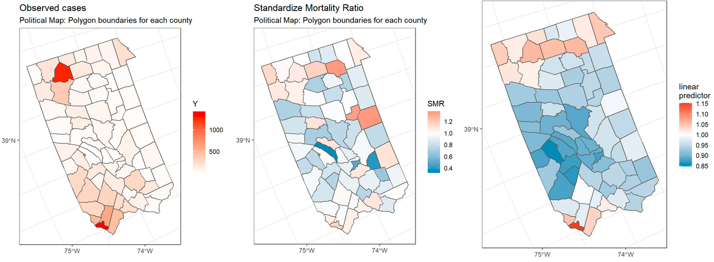
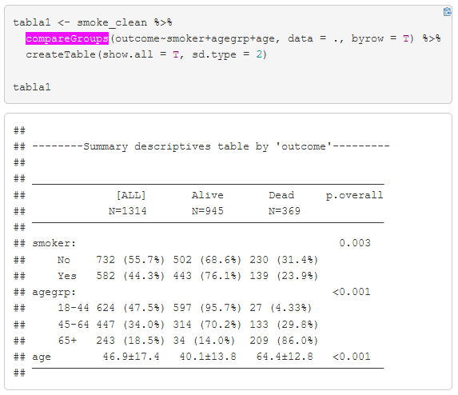
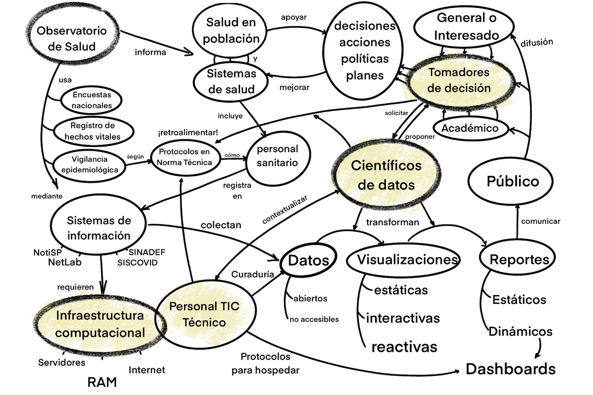
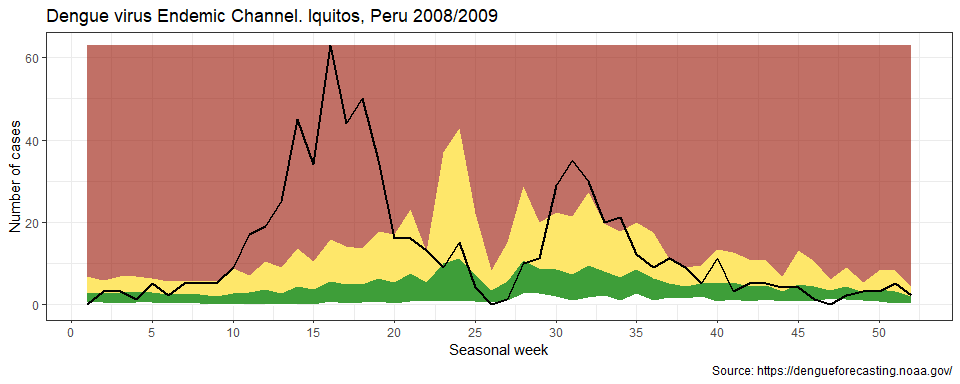
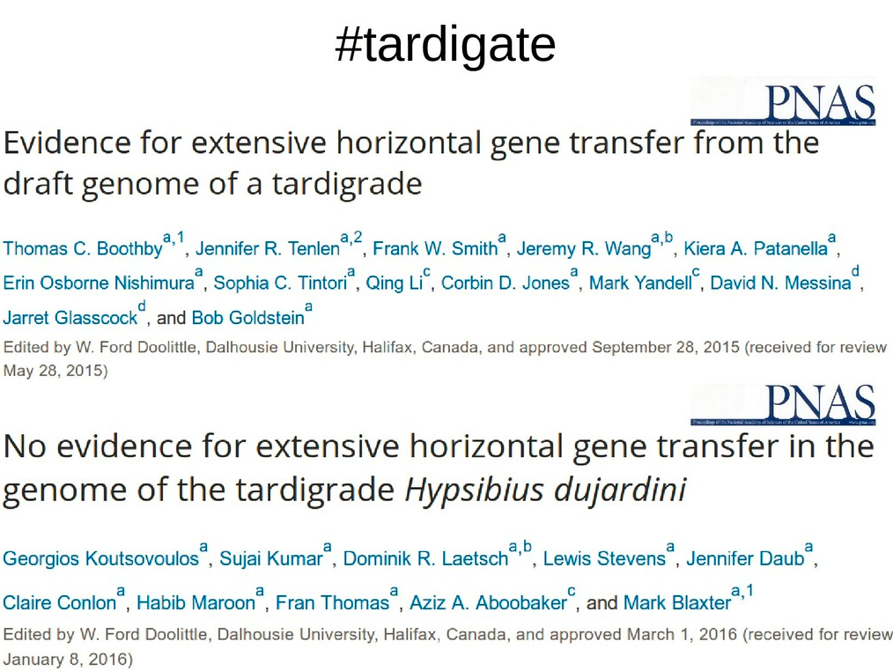
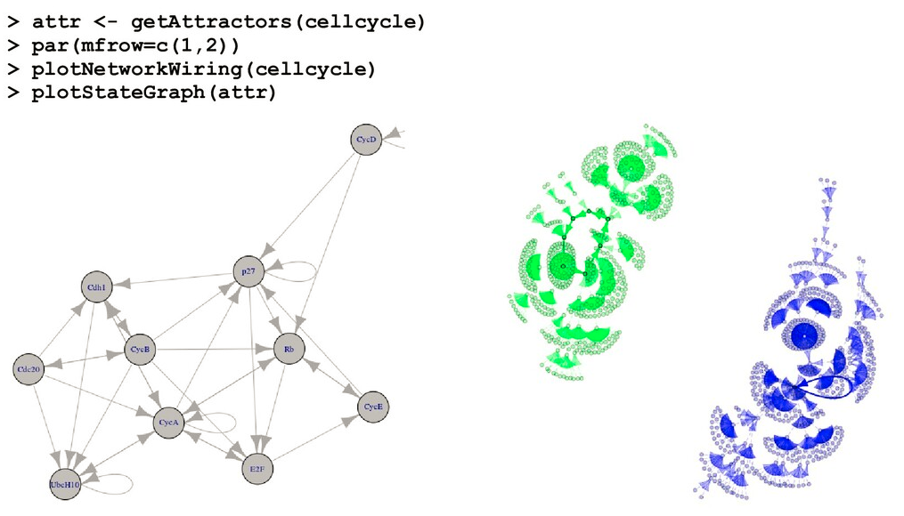

📌 __[ES] Data analysis in epidemiological surveillance II: spatial analysis, 2021__

{ width=100% }

- 🍭 slides: http://bit.ly/episurv2021parte2
- ⚒️ tutorial: https://rpubs.com/avallecam/episurv2021parte2

📌 __[ES] Data analysis in epidemiological surveillance I: person, place, time and epidemic curve, 2021__

{ width=100% }

- ⚒️ tutorial: https://rpubs.com/avallecam/episurv2021parte1
- ⚒️ extra: endemic channel https://rpubs.com/avallecam/episurv2021

📌 __[ES] Visualizing public health and field epidemiology data, 2021__

{ width=100% }

- 🍭 slides: https://bit.ly/epiviz2021

📌 __[ES] Algorithms for the detection of aberrations in epidemiological surveillance, 2020__

{ width=100% }

- 🍭 slides: https://avallecam.github.io/episurv2020/0101-surveillance.html
- 🍲 repo: https://github.com/avallecam/episurv2020/blob/main/0101-surveillance.Rmd

📌 __[ES] Tardigrades and Bioinformatics in Horizontal Gene Transfer, 2016__

{ width=100% }

- 🍭 slides: https://bit.ly/tardigate2016

📌 __[ES] Gene regulatory networks using graph theory and finite automatas, 2015-2017__

{ width=100% }

- 🍭 slides: https://bit.ly/biomath2017_
- ⚒️ tutorial: https://github.com/avallecam/gene_regulatory_networks/blob/main/GRN_py/UNAM_mat2.ipynb
- 🍲 repo: https://github.com/avallecam/gene_regulatory_networks
